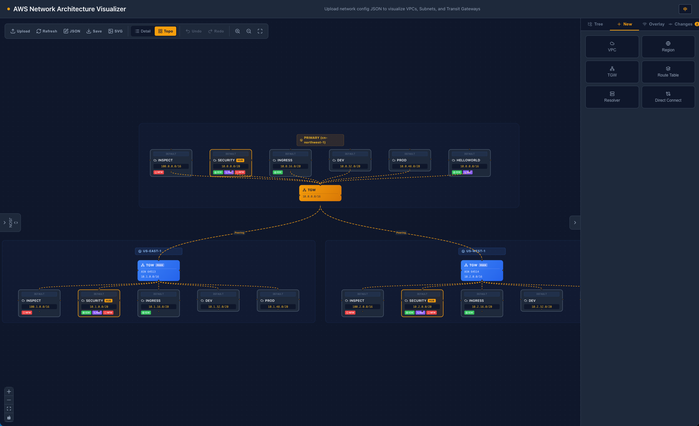
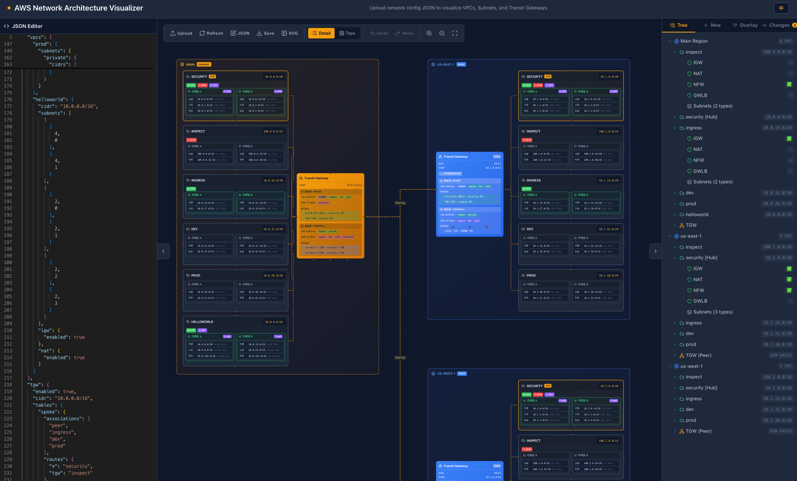

# AWS Network Architecture Visualizer

**[English](README_EN.md) | 中文**

基于 [AWS Cloud Foundations](https://www.amazonaws.cn/solutions/technology/cloud-foundations/) 网络架构的可视化工具，用于直观展示和编辑 Landing Zone 多账户环境下的网络拓扑，包括 VPC、子网、Transit Gateway、Direct Connect 等核心网络资源的配置与连接关系。

## 截图

### 拓扑视图 (Topo View)

按地域分组展示多区域网络拓扑，支持整体拖动和区域折叠：



### 详细视图 (Detailed View)

展示完整的 VPC 内部结构、子网划分、路由表及 TGW 路由策略，左侧集成 JSON 编辑器实时同步：



## 功能特性

### 多视图架构可视化

- **详细视图 (Detailed)** — 展示 VPC 内部子网、路由表、安全组件（IGW / NAT / NFW / GWLB）等完整结构
- **拓扑视图 (Topo)** — 按地域分组的高层网络拓扑，聚焦区域间连接关系与 TGW 对等连接
- **思维导图 (Mind Map)** — 树状结构快速浏览资源层级

### 网络资源支持

- **VPC** — CIDR、子网（Public / Private / Intra）、多账户归属
- **Transit Gateway** — ASN、CIDR、路由表（关联 / 传播 / 静态路由）、Connect 附件
- **TGW 跨区域对等连接 (Peering)** — 主区域与对等区域间的 TGW Peering
- **Direct Connect** — DX Gateway、ASN、前缀通告
- **VPC 对等连接 (Peering)** — 跨 VPC 对等互联
- **安全组件** — Internet Gateway、NAT Gateway、Network Firewall、Gateway Load Balancer
- **端点 (Endpoint)** — 接口端点和网关端点

### JSON 配置编辑器

- 左侧面板集成 Monaco Editor，实时编辑网络配置 JSON
- 点击画布节点自动定位到对应 JSON 路径
- 配置变更实时校验，自动检测错误和警告

### 资源管理面板

- **VPC 创建向导** — 支持选择对等连接目标和 TGW 路由表关联
- **VPN 智能连通性向导** — 创建 Site-to-Site VPN 时自动分析 TGW 路由表，生成连通性计划，展示需要修改的关联/传播/路由及原因
- **Overlay 扩展资源** — 支持在画布上添加 VPN、DX 等扩展资源并可视化
- **变更日志** — 自动追踪 JSON 配置变更和手动操作，分类展示

### 交互特性

- 画布节点点击高亮并同步 JSON 编辑器定位
- TGW 路由表悬停高亮对应连线
- 拓扑视图支持拖动区域背景框整体移动
- 导出画布为 PNG 图片
- 支持中英文切换

## 技术栈

- **React 19** + **TypeScript 5.9**
- **@xyflow/react (React Flow)** — 画布渲染与节点/边交互
- **Monaco Editor** — JSON 配置编辑器
- **Vite 7** — 构建工具
- **Lucide React** — 图标库
- **Zustand 风格状态管理** — Overlay 资源状态

## 快速开始

```bash
# 安装依赖
npm install

# 启动开发服务器
npm run dev

# 构建生产版本
npm run build
```

启动后在浏览器中打开，上传或粘贴 Landing Zone 网络配置 JSON 即可可视化。

## JSON 配置结构

```jsonc
{
  "vpcs": {                    // 主区域 VPC 定义
    "security": {
      "cidr": "10.0.0.0/24",
      "accounts": ["123456789012"],
      "subnets": { "public": {}, "private": {}, "intra": {} },
      "igw": { "enabled": true },
      "nat": { "enabled": true }
    }
  },
  "tgw": {                    // 主区域 Transit Gateway
    "enabled": true,
    "asn": 64512,
    "cidr": "10.254.0.0/24",
    "tables": {
      "pre": { "associations": ["security"], "propagations": ["security"], "routes": {} },
      "post": { "associations": ["workload"], "propagations": ["workload"], "routes": {} }
    }
  },
  "dx": {                     // Direct Connect
    "enabled": true,
    "asn": 65000,
    "prefixes": ["10.0.0.0/8"]
  },
  "ap-southeast-1": {         // 对等区域（以区域名称为 key）
    "vpcs": { ... },
    "tgw": { "enabled": true, "peer": true, ... }
  }
}
```

## 相关资源

- [AWS Cloud Foundations 解决方案](https://www.amazonaws.cn/solutions/technology/cloud-foundations/)
- [AWS Landing Zone 最佳实践](https://docs.aws.amazon.com/prescriptive-guidance/latest/migration-aws-environment/welcome.html)
- [Amazon Transit Gateway 文档](https://docs.aws.amazon.com/vpc/latest/tgw/)
- [Amazon VPC 文档](https://docs.aws.amazon.com/vpc/)

## License

MIT
